# Compound Figure Separation

**Topic:** General Scientific Compound Figure Separation  
**Course:** Applied Deep Learning, TU Wien (WS2025)  
**Student:** Tobias Ponesch (11818774)

> **⚠️ CONTENT WARNING**  
> This dataset contains scientific figures extracted from research papers, which may include biomedical imagery (e.g., organ scans, anatomical diagrams, or surgical photos). Some users may find these images sensitive or disturbing.

---

## Content
[1 Problem Statement & Motivation](#1-problem-statement--motivation)<br>
[2 Data- & Model- Download](#2-data---model--download)<br>
[3 Interactive Demo Application](#3-interactive-demo-application)<br>
[4 Quickstart: Training Preparation](#4-quickstart-training-preparation)<br>
<span style="margin-left: 20px;"></span>[4.1 Environment Setup](#41-environment-setup)<br>
<span style="margin-left: 20px;"></span>[4.2 Start Training](#42-start-training)<br>
[5 Repository Structure](#5-repository-structure)<br>
<span style="margin-left: 20px;"></span>[5.1 Dataset Overview](#51-dataset-overview)<br>
<span style="margin-left: 20px;"></span>[5.2 Folder Structure](#52-folder-structure)<br>
[6 Baseline Models](#6-baseline-models)<br>
<span style="margin-left: 20px;"></span>[6.1 YOLO Version](#61-yolo-version)<br>
<span style="margin-left: 20px;"></span>[6.2 Training Configurations and Results](#62-training-configurations-and-results)<br>
<span style="margin-left: 20px;"></span>[6.3 Qualitative Prediction Examples](#63-qualitative-prediction-examples)<br>
[7 Future Work](#7-future-work)<br>
[8 Detailed Documentation](#8-detailed-documentation)<br>
<span style="margin-left: 20px;"></span>[8.1 Pipeline Overview](#81-pipeline-overview)<br>
<span style="margin-left: 20px;"></span>[8.2 Data Sources and Raw Extraction](#82-data-sources-and-raw-extraction)<br>
<span style="margin-left: 20px;"></span>[8.3 Building the Asset Pool (Single Figures) → `02_assets`](#83-building-the-asset-pool-single-figures--02_assets)<br>
<span style="margin-left: 20px;"></span>[8.4 Real Compound Figure Annotation (Label Studio) → `03_intermediate/SCI-3000_real-compound`](#84-real-compound-figure-annotation-label-studio--03_intermediatesci-3000_real-compound)<br>
<span style="margin-left: 20px;"></span>[8.5 Synthetic Compound Figure Generation (Stitched Singles)](#85-synthetic-compound-figure-generation-stitched-singles)<br>
<span style="margin-left: 20px;"></span>[8.6 Synthetic Compound Chart Generation (Controlled Structures)](#86-synthetic-compound-chart-generation-controlled-structures)<br>
<span style="margin-left: 20px;"></span>[8.7 Dataset Assembly into YOLO-Ready Versions (Notebook-Based)](#87-dataset-assembly-into-yolo-ready-versions-notebook-based)<br>
<span style="margin-left: 20px;"></span>[8.8 Final Dataset Definitions](#88-final-dataset-definitions)<br>
<span style="margin-left: 20px;"></span>[8.9 Time Tracking](#89-time-tracking)<br>
[10 Bibliography](#10-bibliography)

---

## 1 Problem Statement & Motivation

During my bachelor thesis on extracting metadata from scientific charts, I encountered a significant bottleneck: the prevalence of **compound figures**. These are composite images that bundle multiple sub-figures or panels, such as charts, illustrations, or biomedical scans, into a single Figure.

This project addresses the critical need for automated **compound figure separation**. Most downstream tasks, including **chart understanding, OCR, table extraction, and figure-type classification**, assume individual figures as input. Without robust separation, automation pipelines break at the first step, leaving scientific figures largely inaccessible for large-scale analytics.

While existing research heavily favors medical imagery, this project focuses on **general scientific figures**, bridging the gap with a dedicated dataset and a YOLO-based detection model capable of splitting complex figures into their individual components.

---

## 2 Data- & Model- Download
The created datasets and trained models are hosted for download on [Hugging Face](https://huggingface.co/) (README Files still to publish):

The **Dataset** can be downloaded as multiple ZIP files, including images and labels at:
[ CompoundFigureSeparation](https://huggingface.co/datasets/TobiPoni/CompoundFigureSeparation)

The "to beat" **Baseline Models** can be downloaded at:
[ BaseCompoundFigureSeparator](https://huggingface.co/TobiPoni/BaseCompoundFigureSeparator)

**Local Download Tools:**
You can also use the local scripts to easily setup your environment ([Quickstart: Training Preparation](#4-quickstart-training-preparation)) and download the
**[Dataset](src/utils/download_dataset.py):**
```bash
python src/utils/download_dataset.py --select default #To download datasets 04, 05 and 06
python src/utils/download_dataset.py <dataset_nr> #To download a specific dataset
```
and/or the **[Models](src/utils/download_models.py):**
```bash
python src/utils/download_models.py all #To download all models
python src/utils/download_models.py <model_name> #To download a specific model
```


---

## 3 Interactive Demo Application

The repository includes a [Streamlit-based demo application](src/demo_app.py) designed to demonstrate the practical application of the trained models and visualize the compound figure separation process.

**Key Features:**
- **Dynamic Model Selection:** Choose from various baseline models; the application automatically fetches them from Hugging Face upon selection.
- **Flexible Input:** Run inference on sample images from the included datasets or upload your own scientific figures for processing.
- **Side-by-Side Visualization:** Compare model-predicted bounding boxes against ground truth annotations to evaluate performance.
- **Configuration Transparency:** Displays the underlying model architecture and configuration (YOLO `.yaml`) directly in the interface.

To **run the demo** locally, you have to clone this repository and run the following command:
```bash
streamlit run src/demo_app.py
```

---

## 4 Quickstart: Training Preparation
### 4.1 Environment Setup
To quickly start training a model, you can execute the [prepare.py](src/prepare.py) script. This script ensures all dependencies are met, downloads the default datasets (04, 05, and 06), and converts file paths to absolute format so training can start immediately.

It is recommended to use a virtual environment:
```bash
python -m venv .venv
source .venv/bin/activate
python src/prepare.py
```

### 4.2 Start Training
Run the [train.py](src/train.py) script to train a YOLO model on your selected dataset.
```bash
python src/train.py --data 05_selected_classes --name "my_first_run" --epochs 50 --batch 16
```

**Training Options:**
For a full list of available arguments and their defaults, use the help flag:
```bash
python src/train.py -h
```
| Argument | Description |
| :--- | :--- |
| `--data` | Path to `data.yaml` or dataset folder name (e.g., `04_all_classes`) |
| `--name` | Name for this training run |
| `--model` | YOLO model variant (e.g., `yolo11n.pt`, `yolo11s.pt`) |
| `--epochs` | Number of training epochs |
| `--batch` | Batch size for training |
| `--imgsz` | Image size for inference (e.g., `960`) |
| `--device` | CUDA device (e.g. `0`) or `cpu` |

---

## 5 Repository Structure
### 5.1 Dataset Overview
The open sourced dataset covers six different versions of the dataset, all stored in the `dataset/` folder, downloadable from Hugging Face (see [2 Data- & Model- Download (Huggingface)](#2-data--model--download-huggingface)). Model ready datasets are 04_all_classes, 05_selected_classes and 06_selected_classes.

#### 5.1.1 Pre Datasets
The pre datasets are the datasets that were used to create the model ready datasets.
##### 5.1.1.1 `01_raw` (to be uploaded)
This directory contains the raw images, extracted from the SCI-3000[8] PDFs. There are a total of 9505 images extracted from the PDFs.

##### 5.1.1.2 `02_assets`
This directory contains the as **Singles** labeled figures from the SCI-3000 (~1.100 images) dataset, which were hand labeled as `Chart`, `Illustration`, `Image`, `Table` or `Other`. 
It also contains real compound Figures from the MedICaT[7] dataset, which were not used yet, due to their inconsistent quality of their labels.

##### 5.1.1.3 `03_intermediate`
The intermediate directory contains
1. `SCI-3000_real-compound`:
This Folder contains the real compound figures extracted from the SCI-3000 dataset, including the label-studio export. ~ 700 images were labeled in label-studio with bounding boxes for 
- `Chart`
- `Illustration`
- `Image`
- `Other`
- `Shared legend`
- `Shared Title`
- `Shared X-Axis`
- `Shared Y-Axis`
- `Subpanel`
- `Other`
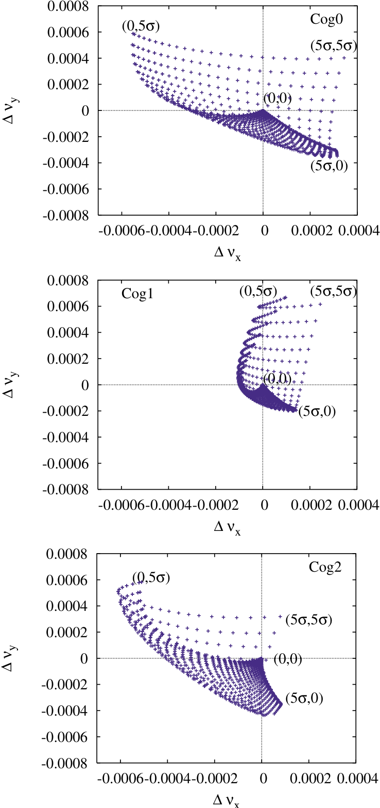

2. `SCI-3000_synthetic-generated`: This directory contains the **10.000** synthetically stitched together compound images, that were generated using the singles from the SCI-3000 dataset[8], stored in `02_assets/SCI-3000_singles`. The folder contains the images, a yolo-labels folder and a `synthetic_labels.json` file.
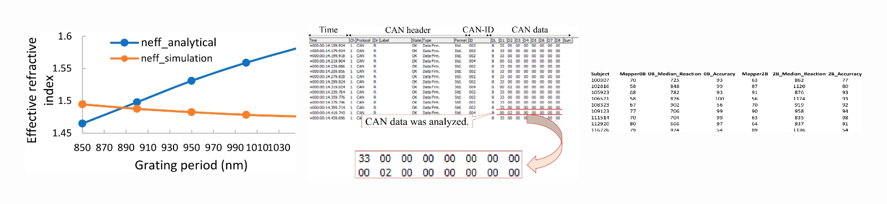
Read the [Detailed Documentation here]().

3. `SyntheticCompoundPlots`: During training tests, there was a lack of performance especially in identifying *Shared Titles*, *Shared Legends*, *Shared Axes* and *Sub Panels* in charts, therefore the dataset was extended by 2.500 synthetically generated compound charts, with varying sub-panel configurations. The folder contains the images and a yolo-labels folder.
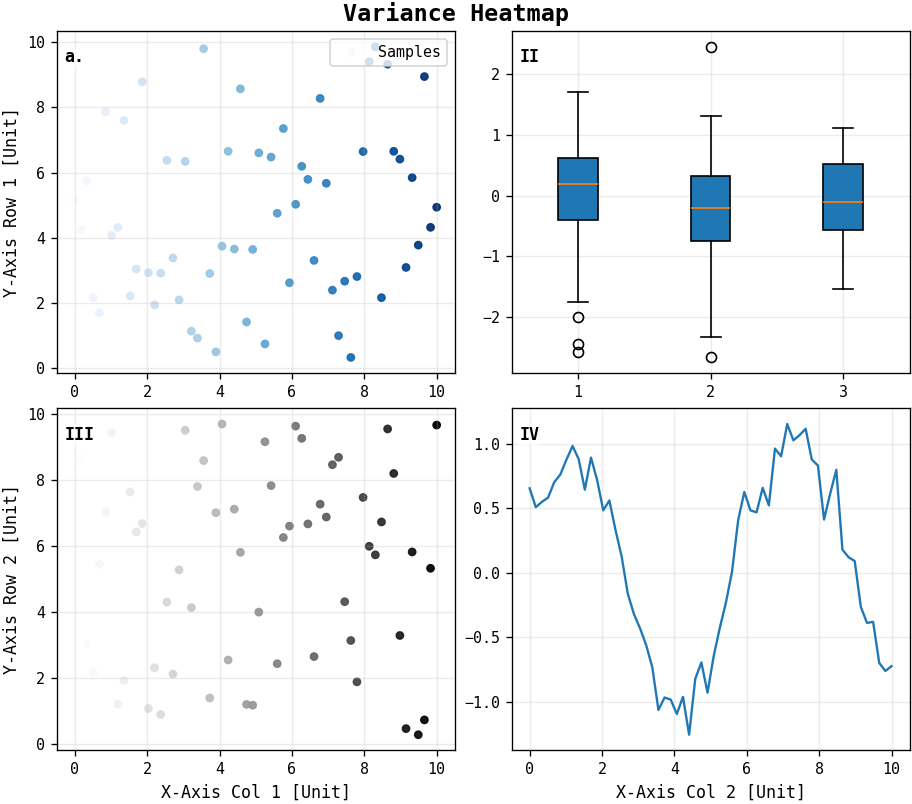
Read the [Detailed Documentation here]().

#### 5.1.2 Model Ready Datasets
The model ready datasets all include the images and a yolo-labels folder, as well as a `data.yaml` file, a `test.txt`, a `train.txt` and a `val.txt` file. All dataset splits were generated using the [04_Dataset_Assembly.ipynb](notebooks/04_Dataset_Assembly.ipynb) notebook and have a train/val/test split. The train split contains synthetically generated compound images and real compound images, while the val and test splits only contain real compound images.
##### 5.1.2.1 `04_all_classes`
This directory contains the final dataset, which is a combination of the real compound figures from the SCI-3000 dataset, the synthetically generated compound figures (stitched SCI-3000 Singles) and the synthetic compound plots. The folder contains the images and a yolo-labels folder. For this dataset, all classes were kept. This Folder contains
```
04_all_classes/
├──images/
├──yolo-labels/
├──data.yaml
├──test.txt
├──train.txt
└──val.txt
```
**Focus:** Sparate compound Figures into all their present sub-objects (e.g. `Chart`, `Illustration`, `Image`, `Table`, `Other`, `Shared legend`, `Shared title`, `Shared x-axis`, `Shared y-axis`, `Subpanel`)
> **⚠️ Important Note:** Due to class inbalances, oversampling and stratified splits were performed, to tackle bias in the training process. Also, 50 synthetic compound images including `Table` boxes were added to the validation and test set splits, due to the scarcity of real compound images with `Table` boxes.

##### 5.1.2.2 `05_selected_classes`
This directory contains the same images as `04_all_classes`, but only the following classes (high level) classes were kept:
- `Chart`
- `Illustration`
- `Image`
- `Other`
- `Table` (remapped)

```
05_selected_classes/
├──images/
├──yolo-labels/
├──data.yaml
├──test.txt
├──train.txt
└──val.txt
```
**Focus:** Separate compound Figures into their high level sub-objects (e.g. `Chart`, `Illustration`, `Image`, `Table`, `Other`)
> **⚠️ Important Note:** Due to class inbalances, oversampling and stratified splits were performed, to tackle bias in the training process. Also, 50 synthetic compound images including `Table` boxes were added to the validation and test set splits, due to the scarcity of real compound images with `Table` boxes.


##### 5.1.2.3 `06_compound_chart_splitter`
This directory contains the dataset that focuses on splitting charts into their sub-objects. It only contains a selection from the images of the `04_all_classes` dataset, namely the ones with only `Charts` in them. The labels then only contain the clases:
- `Shared Legend`
- `Shared Title`
- `Shared X-Axis`
- `Shared Y-Axis`
- `Subpanel`

```
06_compound_chart_splitter/
├──images/
├──yolo-labels/
├──data.yaml
├──test.txt
├──train.txt
└──val.txt
```

**Focus:** Separate Charts into their building blocks (subpanels, shared axes, shared titles, shared legends).
> **⚠️ Important Note:** Due to shortages of hand labeled compound charts, the validation and test splits contain only very few images, and there might be more work to do to improve the model's performance (e.g. less real compound charts in train dataset, hand label more real compound charts from SCI-3000, etc.).
### 5.2 Folder Structure
```
11818774_CompoundFigureSeparation/
├── dataset/                                # Where the dataset will be downloaded to
├── docs/
│   ├── assets/                             # Holds example images
│   └── metrics/                            # Holds results of the models on the test set
├── models/                                 # Where models will be downloaded to
├── src/                                    # Includes all the source code
│   ├── archive/                            # Old scripts
│   ├── generators/                         # Code for generators used to create synthetic data
│   ├── notebooks/                          # All notebooks used in the project
│   ├── utils/                              # Other utility scripts
│   ├── demo_app.py
│   ├── prepare.py
│   └── train.py
├── tests/                                  # Unit tests to verify dataset and GPU availability
│   ├── test_dataset_integrity.py
│   └── test_gpu_availability.py
├── data_links/                             # Linked large external datasets
│   └── data/
│       ├── medicat_release/
│       │   ├── figures/
│       │   ├── roco_references/
│       │   ├── medicat_grading.json        # Custom grading file for image quality
│       │   ├── s2_full_figures_oa_nonroco_combined_medical_top4_public.jsonl
│       │   └── subcaptions_public.jsonl
│       └── SCI-3000/
│           ├── Annotations/
│           ├── FiguresRaw/
│           ├── PDFs/
│           ├── interesting_pages.md
│           ├── LICENCE
│           ├── README.md
│           ├── sci-3000-page-metadata.parquet
│           └── sci-3000-pdf-metadata.parquet
└── requirements.txt                         # Project dependencies
```

---

## 6 Baseline Models

### 6.1 YOLO Version

All baseline experiments were conducted using **YOLOv11** from the Ultralytics framework (`ultralytics v8.3.241`).  
YOLO was chosen as a strong single-stage object detector to validate the dataset and characterize task difficulty.

The following model variants were evaluated:
- `yolo11n` (nano)
- `yolo11s` (small)
- `yolo11m` (medium)

All models were initialized from pretrained weights.

### 6.2 Training Configurations and Results

The following configurations were explored across the three model-ready datasets:

| Dataset | Model | Img | Ep | Bs | mAP50–95 | mAP50 |
|------|------|----:|---:|---:|---------:|------:|
| 04_all_classes | yolo11n | 640  | 20  | 32 | 0.475 | 0.589 |
| 04_all_classes | yolo11s | 960  | 40  | 16 | **0.589** | **0.652** |
| 04_all_classes | yolo11s | 1280 | 60  | 16 | 0.559 | 0.640 |
| 05_selected_classes | yolo11n | 1280 | 50  | 16 | **0.888** | **0.949** |
| 06_compound_chart_splitter | yolo11n | 1280 | 50  | 16 | **0.436** | **0.622** |
| 06_compound_chart_splitter | yolo11s | 1280 | 50  | 16 | 0.433 | 0.587 |
| 06_compound_chart_splitter | yolo11m | 1280 | 100 | 8  | 0.436 | 0.598 |

The best checkpoint per run was selected based on **validation mAP50–95** and evaluated on the test split.

**Summary:**
- High-level compound figure separation shows strong performance.
- Fine-grained structural detection remains challenging.
- Model scaling alone does not overcome data limitations.

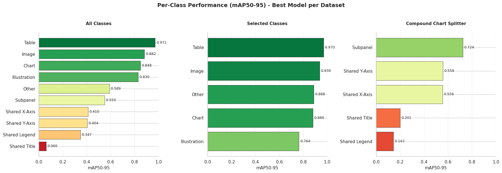

### 6.3 Qualitative Prediction Examples

#### `04_all_classes`

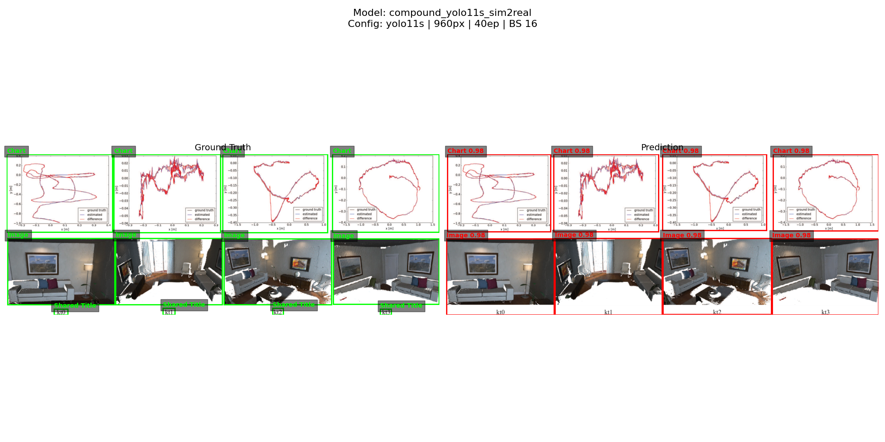

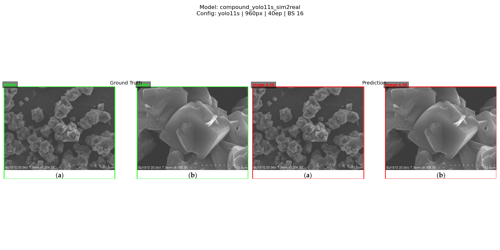

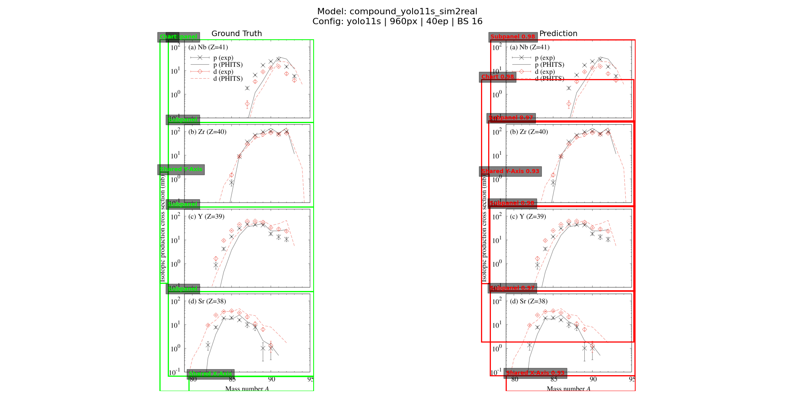
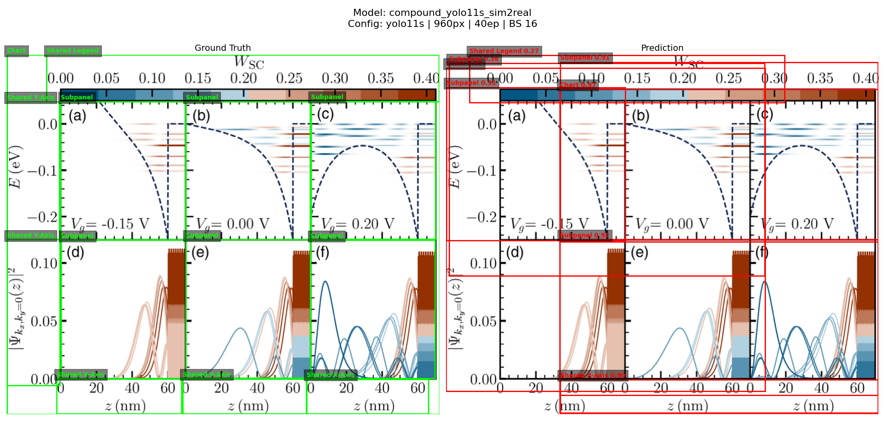


#### `05_selected_classes`

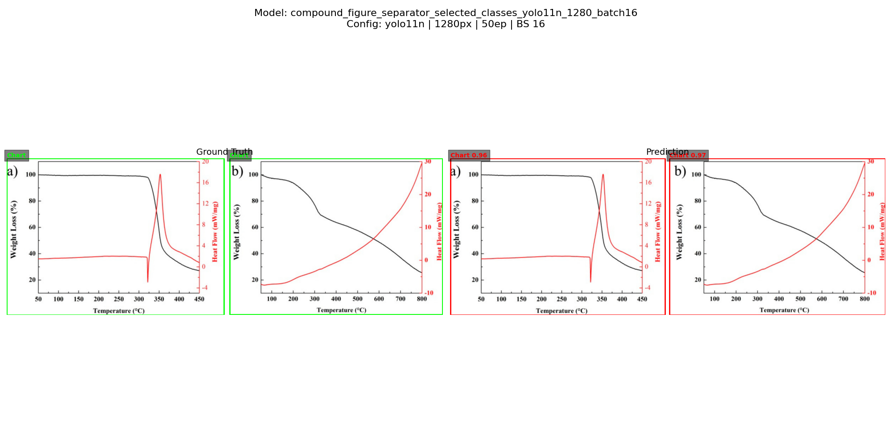
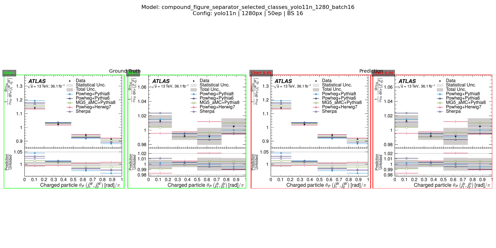
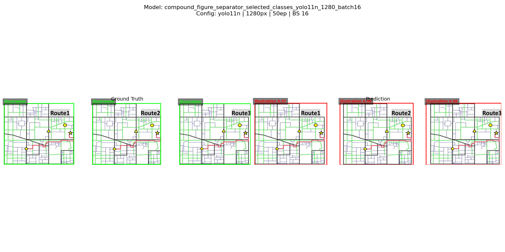

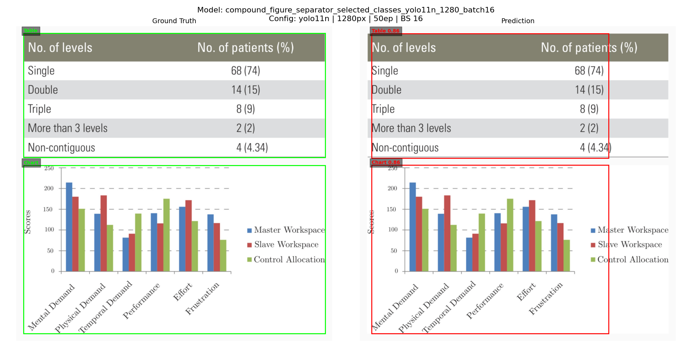

#### `06_compound_chart_splitter`

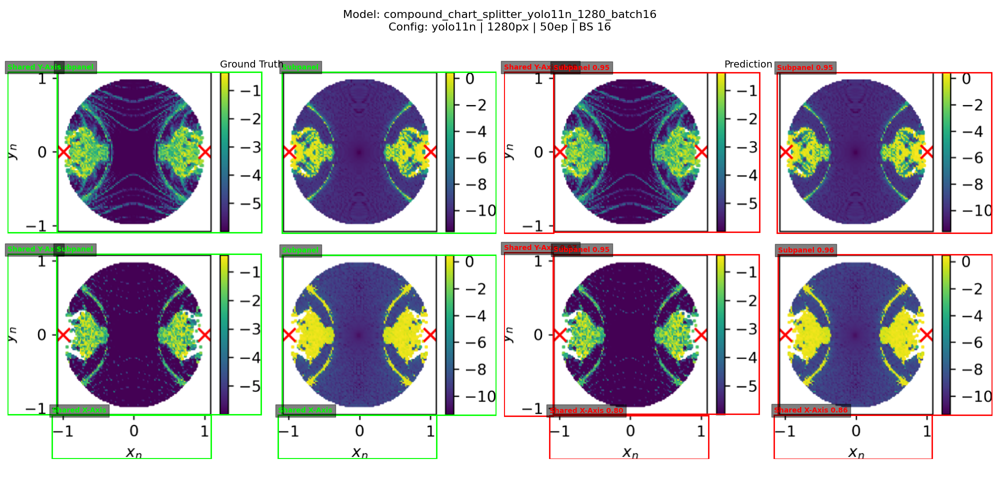
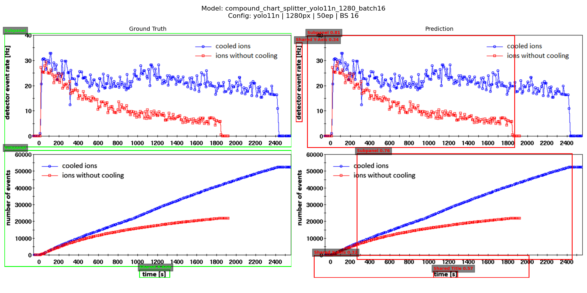
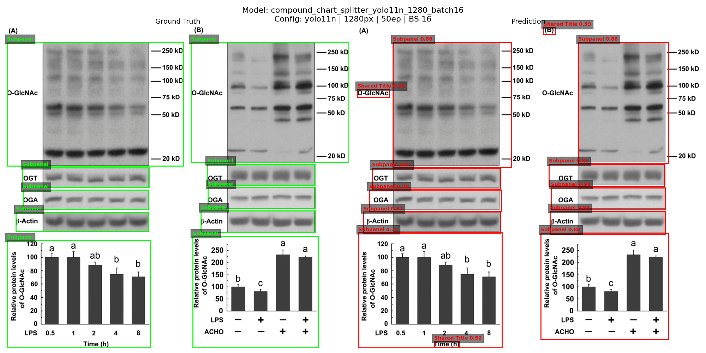
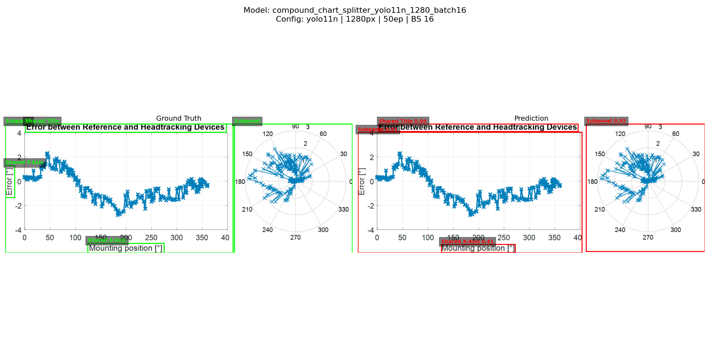

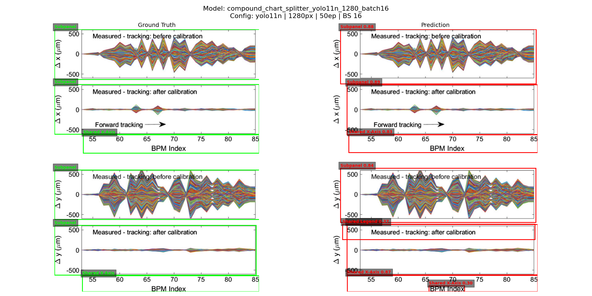

---

## 7 Future Work

While the presented baselines demonstrate that YOLOv11 is a strong starting point for compound figure separation, several directions remain for future work:

- **Expand real-world annotations:**  
  The primary limitation of the current datasets is the scarcity of hand-labeled real compound figures, especially for shared structural elements (titles, legends, axes). Labeling additional figures from the SCI-3000 corpus is expected to yield larger performance gains than further model scaling.

- **Two-stage or hierarchical approaches:**  
  Separating high-level figures first (e.g., charts vs. images) and subsequently resolving fine-grained structures within each component may reduce task complexity and improve robustness for compound charts.

- **Reduce synthetic-to-real gap:**  
  While synthetic augmentation proved essential, further improvements in synthetic realism and layout diversity could help close the remaining gap between synthetic training data and real scientific figures.

Overall, future progress is expected to be driven primarily by **better real-world data coverage**, rather than increased model size or longer training schedules.

---

## 8 Detailed Documentation

This chapter documents the complete workflow used to build the dataset(s) and train the baseline models. It focuses on *methodology only* (no results, no future work), and describes the concrete steps taken in this repository: data ingestion, labeling, synthetic generation, dataset assembly, validation, and model training.


### 8.1 Pipeline Overview

The project produces multiple dataset versions with different goals and difficulty levels. The overall pipeline can be summarized as:

1. **Extract raw figures** from scientific PDFs (SCI-3000) → `01_raw`
2. **Create single-figure assets** (hand-labeled) used for synthetic generation → `02_assets`
3. **Label real compound figures** from SCI-3000 in Label Studio → `03_intermediate/SCI-3000_real-compound`
4. **Generate synthetic compound figures** by stitching single figures → `03_intermediate/SCI-3000_synthetic-generated`
5. **Generate synthetic compound charts** with controlled shared-structure configurations → `03_intermediate/SyntheticCompoundPlots`
6. **Assemble YOLO-ready datasets** with consistent classes and splits → `04_all_classes`, `05_selected_classes`, `06_compound_chart_splitter`
7. **Train baseline YOLO models** using Ultralytics training pipeline → `src/train.py`
8. **Validate integrity** with basic tests and sanity checks → `tests/`, notebooks


### 8.2 Data Sources and Raw Extraction

#### 8.2.1 SCI-3000 (Primary Source)
SCI-3000 is used as the main source for real-world figures. PDFs are stored under:

- `data_links/data/SCI-3000/PDFs/`

#### 8.2.2 Raw Figure Extraction → `01_raw`
All figures were extracted from the SCI-3000 PDFs into an initial raw pool:

- `dataset/01_raw/` *(to be uploaded)*

This step yields the large unfiltered pool of extracted figures (including singles, compounds, charts, images, tables, etc.). The raw pool is treated as a **source-of-truth** for later sampling and filtering steps.


### 8.3 Building the Asset Pool (Single Figures) → `02_assets`

To generate synthetic compound figures, a curated set of **single-panel figures** is needed.

#### 8.3.1 SCI-3000 Singles
A subset of extracted figures was manually labeled as *single* figures and categorized into high-level classes:

- `Chart`
- `Illustration`
- `Image`
- `Table`
- `Other`

These singles are stored in:

- `dataset/02_assets/SCI-3000_singles/` *(as described in README)*

They serve two purposes:
1. **Training data augmentation** via synthetic compounds
2. **Controlled generation** of compounds where object locations are known exactly

#### 8.3.2 Optional External Data (MedICaT[7])
MedICaT is linked in `data_links/`, but was not used as a core training source due to label inconsistency and quality variation. It is retained for potential future extensions.


### 8.4 Real Compound Figure Annotation (Label Studio) → `03_intermediate/SCI-3000_real-compound`

Real compound figures were manually annotated using Label Studio.

#### 8.4.1 Target Classes for Real Compound Labeling
Annotations were created using bounding boxes for:

- `Chart`
- `Illustration`
- `Image`
- `Table`
- `Other`
- `Shared legend`
- `Shared Title`
- `Shared X-Axis`
- `Shared Y-Axis`
- `Subpanel`

This label schema intentionally includes both:
- **high-level panel types** (chart/image/table/...)
- **structural chart elements** (shared axes/titles/legends + subpanels)

#### 8.4.2 Export Handling
Label Studio exports are stored along with the images in:

- `dataset/03_intermediate/SCI-3000_real-compound/`

The export is then converted into YOLO labels during dataset assembly. Any conversion step must:
- map Label Studio categories to dataset class IDs
- normalize bounding boxes to YOLO format `(x_center, y_center, w, h)` in `[0,1]`
- ensure image/label filename alignment


### 8.5 Synthetic Compound Figure Generation (Stitched Singles)
**Motivation:** Real compound figures are scarce and expensive to label. Synthetic compounds provide:
- large-scale training volume
- clean ground-truth bounding boxes
- controllable layout diversity

Synthetic stitched compounds are stored in:

- `dataset/03_intermediate/SCI-3000_synthetic-generated/`

#### 8.5.1 Input
- single-panel assets from `02_assets/SCI-3000_singles/`

#### 8.5.2 Generation Strategy
The generator stitches multiple single figures into a larger canvas. Key operations typically include:
- selecting `n` singles per synthetic compound
- choosing a grid / row / column layout
- resizing panels while preserving aspect ratios (or using padding)
- placing panels with spacing margins
- writing out:
  - final synthetic image
  - YOLO labels for each placed panel
  - metadata JSON (`synthetic_labels.json`) for reproducibility/debugging

#### 8.5.3 Output
- `images/` (synthetic compound images)
- `yolo-labels/` (YOLO label files)
- `synthetic_labels.json` (panel placement metadata)

The goal of this stage is primarily to boost representation of compound layout patterns and high-level object separation.


### 8.6 Synthetic Compound Chart Generation (Controlled Structures)
During early experiments, the detection of *structural elements* (shared titles, legends, axes, subpanels) proved particularly challenging. To address this, an additional synthetic dataset of compound charts was created:

- `dataset/03_intermediate/SyntheticCompoundPlots/`

#### 8.6.1 Motivation
Real compound charts with shared structures are:
- relatively rare
- more ambiguous to annotate
- highly diverse in style

Synthetic charts allow explicit construction of known cases:
- subpanels in rows/columns
- shared x-axis vs shared y-axis
- shared title / shared legend placement
- mixed tick labels vs shared axis labels, etc.

#### 8.6.2 Generation Concept
A plot generator produces multi-panel chart figures (e.g., Matplotlib-based), and additionally renders explicit bounding boxes for:
- `Subpanel`
- `Shared Title`
- `Shared Legend`
- `Shared X-Axis`
- `Shared Y-Axis`

For each generated compound chart:
1. Layout is sampled (rows/cols, spacing, structure-sharing rules)
2. Subplots are rendered
3. Shared elements (title/legend/axes) are placed deterministically
4. Bounding boxes are recorded from known geometry
5. Image + YOLO labels are written to disk

This synthetic set specifically targets dataset `06_compound_chart_splitter` and also contributes to `04_all_classes`.


### 8.7 Dataset Assembly into YOLO-Ready Versions (Notebook-Based)
All final datasets are assembled using:

- `notebooks/04_Dataset_Assembly.ipynb`

The notebook performs:
- file collection from intermediate sources
- label conversion / merging
- class remapping (depending on dataset version)
- train/val/test splitting
- oversampling / stratification
- exporting `data.yaml` + split lists

#### 8.7.1 Common YOLO Dataset Layout
Each final dataset follows:
```
<dataset_name>/
├── images/
├── yolo-labels/
├── data.yaml
├── train.txt
├── val.txt
└── test.txt
```
Where `train.txt`, `val.txt`, `test.txt` contain image paths.

#### 8.7.2 Split Policy (Sim2Real-Oriented)
To evaluate generalization to real data, the split strategy is:

- **Train:** mixture of synthetic + real compound figures
- **Val/Test:** primarily real compound figures

Rationale:
- synthetic provides scale and diversity
- validation/test should represent the real-world target distribution

#### 8.7.3 Handling Class Imbalance
Multiple classes are naturally sparse (e.g., `Table`, or some shared-structure labels). To reduce bias:
- oversampling is performed for underrepresented classes
- splits aim to preserve class presence (stratified where feasible)

Additionally, due to scarcity of the label `Table`, 50 synthetic compounds including `Table` boxes were added to the validation and test splits.


### 8.8 Final Dataset Definitions

#### 8.8.1 `04_all_classes`
**Goal:** Full separation into high-level panels and chart structural elements.

Includes all labeled object categories:
- `Chart`, `Illustration`, `Image`, `Table`, `Other`
- `Shared legend`, `Shared Title`, `Shared X-Axis`, `Shared Y-Axis`
- `Subpanel`

Sources:
- real labeled compounds (Label Studio)
- stitched synthetic compounds
- synthetic compound plots

#### 8.8.2 `05_selected_classes`
**Goal:** High-level panel separation only.

Kept classes:
- `Chart`
- `Illustration`
- `Image`
- `Table`
- `Other`

Implementation detail:
- labels are filtered/remapped from the same underlying images used in `04_all_classes`
- structural classes are dropped
- `Table` may be remapped depending on original labeling consistency

#### 8.8.3 `06_compound_chart_splitter`
**Goal:** Chart-focused structure splitting.

This dataset includes only images that contain charts and focuses on:
- `Shared Legend`
- `Shared Title`
- `Shared X-Axis`
- `Shared Y-Axis`
- `Subpanel`

Selection rule:
- only compounds that are chart-only (or meet chart-focused criteria) are included
- labels are filtered to structural classes only

### 8.9 Time Tracking
Part of the Assignment was to track the time spend on the different project parts. The following table summarizes the time spend on the different parts of the project.
| Task | What’s included | Time spent (hours) |
|---|---|---|
| Project setup | scope, goals, planning, repository initialization | 4 |
| Background research | related work, baseline selection, approach justification | 4 |
| Data acquisition | obtaining datasets/sources, organizing inputs, initial access checks | 6 |
| Data exploration | sampling, sanity checks, understanding distributions and edge cases | 4 |
| Data curation | filtering, cleaning, quality screening, removing unusable samples | 4 |
| Annotation planning | label schema, guidelines, class definitions, tooling decisions | 3 |
| Manual annotation | labeling work, review passes, consistency checks | 20 |
| Data preprocessing | format conversions, label normalization, path handling, remapping | 5 |
| Data augmentation / synthesis | generating additional data, variations, auto-label creation | 10 |
| Dataset construction | merging sources, creating dataset versions, class filtering | 5 |
| Split design | train/val/test policy, stratification, balancing/oversampling strategy | 6 |
| Validation & integrity checks | automated checks, spot checks, debugging broken samples | 3 |
| Training pipeline setup | scripts/configuration, environment preparation, reproducibility setup | 5 |
| Model training | baseline runs, experiment tracking, checkpoint handling | 15 |
| Debugging & iteration | fixing issues, re-generating data, re-labeling, reruns | 6 |
| Qualitative analysis | visual inspection, example selection, failure-case review | 4 |
| Demo / application | simple interface, inference pipeline, visualization | 3 |
| Documentation| README, methodology write-up, usage instructions | 5 |
| Final deliverables | report, presentation, submission preparation | 6 |
| Total | | **~120** |

---


## 9 Bibliography
[1] **Compound Figure Separation of Biomedical Images with Side Loss**
    Yao, T. et al. (2021). *arXiv preprint arXiv:2107.08650*.

[2] **Compound Figure Separation of Biomedical Images: Mining Large Datasets for Self-supervised Learning**
    Yao, T. et al. (2022). *arXiv preprint arXiv:2208.14357*.

[3] **Compound image segmentation of published biomedical figures**
    Li, P. et al. (2018). *Bioinformatics*, 34(14), 2549–2557.

[4] **A Data Driven Approach for Compound Figure Separation Using Convolutional Neural Networks**
    Tsutsui, S., & Crandall, D. (2017). *arXiv preprint arXiv:1703.05105*.

[5] **FigureSeer: Parsing Result-Figures in Research Papers**
    Siegel, N. et al. (2016). *European Conference on Computer Vision (ECCV) Workshops*.

[6] **Label Studio: Data labeling software**
    Tkachenko, M., Malyuk, M., Holmanyuk, A., & Liubimov, N. (2020-2025).
    [https://github.com/HumanSignal/label-studio](https://github.com/HumanSignal/label-studio)

[7] **MedICaT: A Dataset of Medical Images, Captions, and Textual References**
    Subramanian, S. et al. (2020). *arXiv preprint arXiv:2010.06000*.
    [https://arxiv.org/abs/2010.06000](https://arxiv.org/abs/2010.06000)

[8] **SCI-3000: A novel dataset for the task of figure, table, and caption extraction from scientific PDFs**
    Darmanovic, F. (2020).
    [https://repositum.tuwien.at/handle/20.500.12708/81300](https://repositum.tuwien.at/handle/20.500.12708/81300)

[9] **DocFigure: A Dataset for Scientific Document Figure Classification**
    [https://cvit.iiit.ac.in/usodi/Docfig.php](https://cvit.iiit.ac.in/usodi/Docfig.php)

[10] **SciCap: Scientific Figures Dataset**
    [https://github.com/tingyaohsu/SciCap](https://github.com/tingyaohsu/SciCap)

[11] **FigureSeer: Parsing Result-Figures in Research Papers (Project Page)**
    [https://prior.allenai.org/projects/figureseer](https://prior.allenai.org/projects/figureseer)


